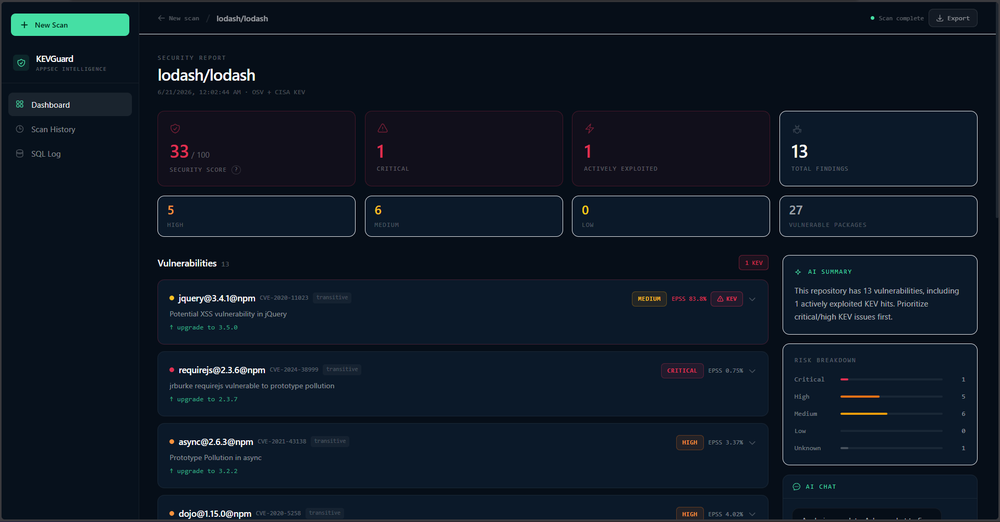
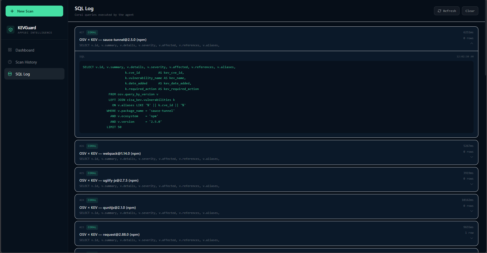
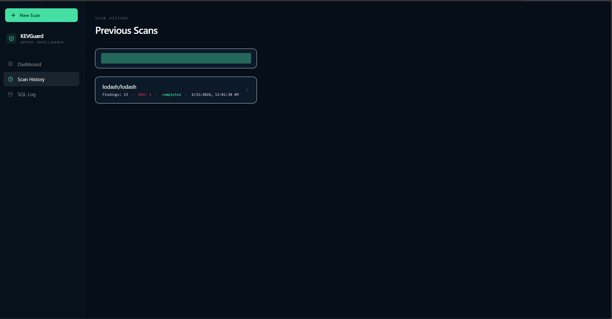

# KEVGuard

An AI-powered dependency security scanner for GitHub repositories. Paste a repo URL, get a full vulnerability report in seconds — powered by Coral's cross-source SQL intelligence.

---

## What it does

KEVGuard scans a GitHub repository's dependencies and checks them against multiple threat intelligence sources simultaneously. Instead of making separate API calls and stitching results together in code, KEVGuard uses a single Coral SQL cross-join query to hit OSV, CISA KEV, and GitHub in one shot.

The result is a consolidated security report showing:

- Known vulnerabilities with CVE IDs and severity scores (OSV)
- Actively exploited vulnerabilities flagged by CISA KEV
- EPSS scores showing the 30-day probability of exploitation in the wild
- CVSS severity fallback via NVD for any gaps in OSV data
- Direct vs transitive dependency classification
- Minimum safe version to upgrade to
- AI-generated plain-English triage summary

---

## How Coral powers this

Coral is the intelligence core of KEVGuard. Rather than calling OSV, CISA KEV, and GitHub as separate APIs and joining the data manually, KEVGuard routes everything through a single Coral MCP bridge using a SQL cross-join:

```sql
SELECT v.id, v.summary, v.severity, v.affected, v.references, v.aliases,
       k.cve_id          AS kev_cve_id,
       k.vulnerability_name AS kev_name,
       k.date_added      AS kev_date_added,
       k.required_action AS kev_required_action
FROM osv.query_by_version v
LEFT JOIN cisa_kev.vulnerabilities k
  ON v.aliases LIKE '%' || k.cve_id || '%'
WHERE v.package_name = 'lodash'
  AND v.ecosystem    = 'npm'
  AND v.version      = '4.17.21'
LIMIT 50
```

This means:

- One query replaces three API calls
- KEV exploitation status is joined at the data layer, not in application code
- The full query is logged and auditable via the SQL Log tab in the UI
- Results are deterministic and reproducible

Every finding in a KEVGuard report can be traced back to a single Coral query.

---

## Tech stack

| Layer | Technology |
|---|---|
| Frontend | React, Tailwind CSS |
| Backend | FastAPI (Python) |
| AI | Gemini API — plain-English triage summaries |
| Intelligence core | Coral MCP — OSV + CISA KEV cross-join |
| Severity fallback | NVD API — fills missing CVSS scores |
| Exploit probability | EPSS (first.org) — 30-day exploitation likelihood |

---

## How it works

1. User submits a GitHub repository URL
2. Coral fetches the dependency manifest from GitHub (`package.json`, `requirements.txt`, `go.mod`, `Cargo.lock`, `pom.xml`)
3. A single Coral SQL cross-join queries OSV for vulnerabilities and CISA KEV for active exploitation status simultaneously
4. NVD fills in any CVSS scores that OSV does not have
5. Each CVE gets an EPSS score from first.org
6. Gemini generates a plain-English summary — what to fix first and why
7. Results are returned as a scored report with exportable JSON/CSV output

---

## Getting started

### Prerequisites

- Node.js 18+
- Python 3.11+
- Coral MCP binary (WSL: `/root/.local/bin/coral`)

### Setup

```bash
# 1. Clone
git clone https://github.com/Prem4777/KEVGaurd.git
cd KEVGaurd

# 2. Backend dependencies
cd backend
pip install -r requirements.txt
cp .env.example .env
# Add your GEMINI_API_KEY to .env

# 3. Frontend dependencies
cd ../frontend
npm install
```

### Running

Double-click `start.bat` — it opens three terminals:

| Terminal | Service | URL |
|---|---|---|
| Coral Bridge | `node scripts/coral-bridge.mjs` | http://127.0.0.1:8787 |
| API | `uvicorn app.main:app --reload` | http://127.0.0.1:8000 |
| App | `npm run dev` | http://localhost:5173 |

Or start manually:

```bash
# Terminal 1 — from repo root
node scripts/coral-bridge.mjs

# Terminal 2 — from backend/
uvicorn app.main:app --reload --port 8000

# Terminal 3 — from frontend/
npm run dev
```

---

## Output

### Landing — scan input


### Scanning — live process log


### Report — security score + vulnerability list


### Vulnerability detail — CVE, EPSS, remediation


### AI summary + risk breakdown


### SQL log — every Coral query auditable


### Scan history + comparison


---

## Features

- GitHub repository scanning via URL
- Multi-ecosystem dependency extraction (`package.json`, `requirements.txt`, `go.mod`, `Cargo.lock`, `pom.xml`)
- Cross-source vulnerability matching via Coral SQL
- CISA KEV active exploitation detection
- EPSS exploit probability per CVE
- NVD CVSS fallback for unknown severities
- AI-generated risk summaries (Gemini)
- Scan comparison — diff any two scans to see regressions and fixes
- Export to JSON or CSV for CI pipelines and ticketing systems
- Full SQL log — every finding is auditable

---

## Environment variables

Copy `backend/.env.example` to `backend/.env` and fill in:

```env
GEMINI_API_KEY=          # Google AI Studio key
GEMINI_MODEL=gemini-2.0-flash

CORAL_BRIDGE_URL=http://127.0.0.1:8787   # Coral bridge endpoint
CORAL_BRIDGE_TOKEN=                       # Optional auth token
```
